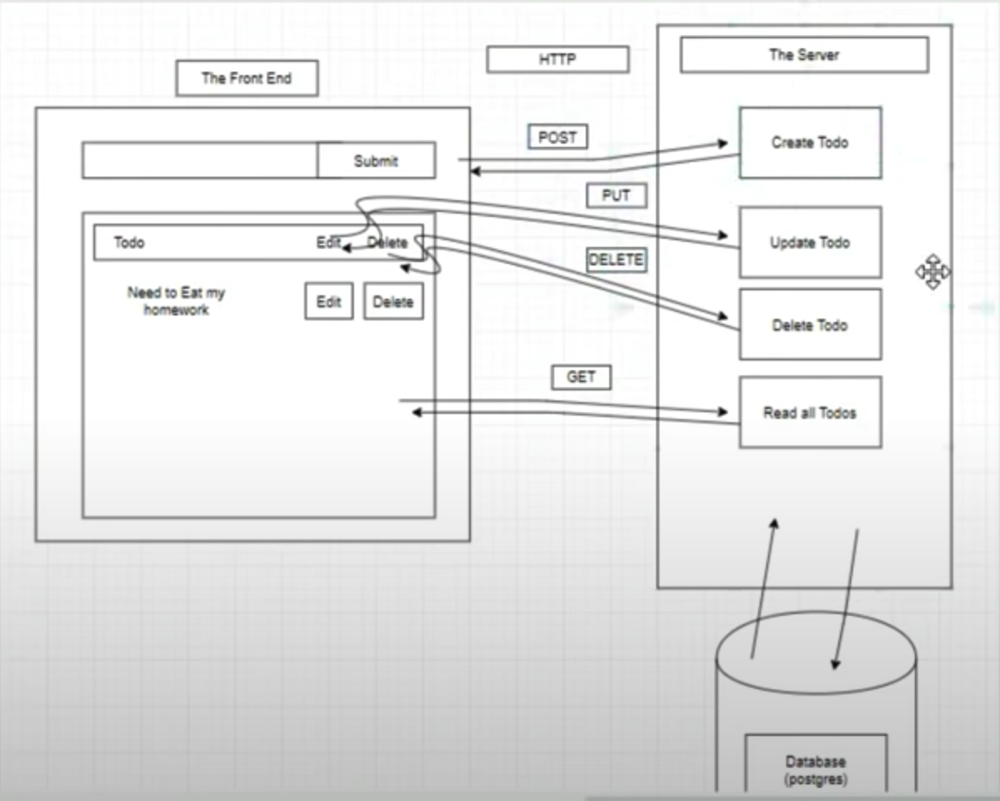

##Full-stack web application based on PostgreSQL, Express, React, and Node.js



---

In the CLIENT project directory, you can run:

### `yarn start`

Runs the app in the development mode.<br />
Open [http://localhost:3000](http://localhost:3000) to view it in the browser.

The page will reload if you make edits.<br />
You will also see any lint errors in the console.

### `yarn build`


---
###PosgreSQL:
```
\l => list of all databases
\c => move inside a database
\dt => show table in database

CREATE DATABASE perntodo; => create a database

CREATE TABLE todo(...); => create a table called 'todo'
```
